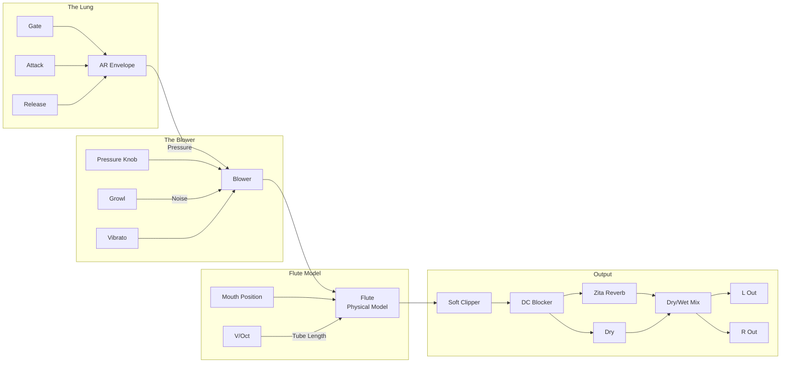

# Chaos Flute

A physical model of a flute that has been "circuit bent" for modular synthesis. Features an internal breath envelope ("Lung") and overblow chaos controls for everything from soft woodwind tones to screaming multiphonics.

## Overview

While a standard flute model requires careful breath control to sound musical, the Chaos Flute includes an internal Attack/Decay envelope that automates the blowing physics. The Pressure control can push the model into chaotic, screaming territory - like Jethro Tull on steroids.

Built with Faust DSP using the physical modeling library.

**Width:** 4HP

## Signal Flow

## Parameters

| Knob | Range | Default | Description |
|------|-------|---------|-------------|
| **Attack** | 1ms - 500ms | 50ms | Breath envelope attack time |
| **Release** | 10ms - 5s | 500ms | Breath envelope release time |
| **Pressure** | 0% - 150% | 60% | Blow pressure. >80% overblows, >100% screams |
| **Mouth** | 10% - 90% | 50% | Embouchure position. Affects timbre and stability |
| **Growl** | 0% - 100% | 0% | Breath noise (simulates singing while playing) |
| **Reverb** | 0% - 100% | 30% | Built-in Zita Rev1 stereo reverb |

## Inputs

| Jack | Description |
|------|-------------|
| **V/Oct** | Pitch control. 0V = C4, standard 1V/octave |
| **Gate** | Triggers the breath envelope when >1V |
| **Press CV** | Modulates pressure. ±10V = ±150% |
| **Mouth CV** | Modulates mouth position. ±10V = ±80% |
| **Verb CV** | Modulates reverb mix. ±10V = ±100% |

## Outputs

| Jack | Description |
|------|-------------|
| **L** | Left audio output |
| **R** | Right audio output |

## Understanding the Parameters

### Attack & Release (The "Lung")
The internal breath envelope handles flute physics automatically:
- **Fast Attack (1-20ms):** Sharp, tongued articulation
- **Slow Attack (100-500ms):** Soft, breathy fade-in
- **Fast Release (10-100ms):** Quick cutoff
- **Slow Release (1-5s):** Natural breath fade with pitch collapse

### Pressure
The chaos control - how hard you "blow":
- **Low (0-40%):** Soft, breathy tone (may not sustain)
- **Normal (50-70%):** Clean, stable flute sound
- **Overblow (80-100%):** Pitch jumps up (harmonics), edgier tone
- **Scream (100-150%):** Chaotic, aggressive multiphonics

### Mouth Position
Embouchure distance from lips to edge:
- **Low (10-30%):** Unstable, prone to chaos, edgier tone
- **Medium (40-60%):** Stable, normal flute sound
- **High (70-90%):** Mellow, breathy, harder to destabilize

### Growl
Adds breath noise to simulate vocal techniques:
- **0%:** Clean breath
- **30-50%:** Subtle breath texture
- **70-100%:** Aggressive growling/singing while playing

## Technical Details

- **Algorithm:** Physical modeling using Faust pm.fluteModel
- **Blower:** pm.blower with dual LFO vibrato (5Hz)
- **Tube Length:** Calculated from V/Oct frequency
- **Soft Clipper:** Cubic nonlinearity to tame chaos peaks
- **Reverb:** Zita Rev1 stereo algorithm

## Patch Ideas

### Standard Flute
1. Pressure at 50-60%
2. Mouth at 50%
3. Attack ~50ms, Release ~500ms
4. Patch V/Oct and Gate from sequencer
5. Add reverb to taste

### The Scream
1. Crank Pressure to maximum (150%)
2. Lower Mouth position (20-30%) for instability
3. Fast Attack for aggressive articulation
4. The pitch will jump and distort chaotically

### Glitchy Textures
1. Patch fast LFO to Mouth CV
2. Moderate Pressure (70-80%)
3. The physical model loses tracking and glitches
4. Creates weird metallic, broken textures

### Breathy Ambient
1. Slow Attack (200-500ms)
2. Long Release (2-5s)
3. Lower Pressure (40-50%)
4. High Reverb (70-100%)
5. Slow, evolving gate patterns

### Growling Lead
1. Pressure at 80-90% (edge of overblow)
2. Growl at 40-60%
3. Fast Attack, medium Release
4. Aggressive, vocal quality

### Ethnic Flute
1. Modulate Mouth position slowly with LFO
2. Moderate Pressure (60-70%)
3. Slight Growl (10-20%)
4. Creates organic, world-music character
