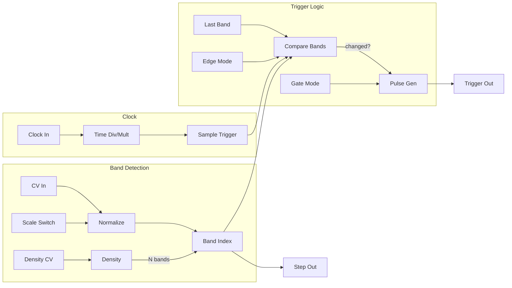

# Intersect

A rhythmic trigger generator that creates Euclidean and Euclidean-adjacent rhythms by analyzing CV signal crossings through quantized bands.

## Overview

Intersect divides the voltage range into configurable bands and generates triggers whenever an input CV signal crosses from one band to another. This creates rhythmic patterns that respond to the shape and speed of your modulation source. Feed it an LFO for steady rhythms, a random source for generative patterns, or audio for beat-synced triggers.

**Width:** 8HP

## Signal Flow

## How It Works

1. The input CV range (bipolar or unipolar) is divided into N equal bands
2. On each clock pulse, Intersect samples the CV and determines which band it's in
3. When the CV moves to a different band than the previous sample, a trigger is generated
4. The **Step** output provides a quantized voltage corresponding to the center of the current band

The display shows the CV waveform history with horizontal lines marking the band divisions. Active bands highlight, and trigger events flash.

## Parameters

| Control | Range | Default | Description |
|---------|-------|---------|-------------|
| **Time Div** | /8 to x8 | x1 | Clock division/multiplication |
| **Density** | 1 - 32 bands | 4 | Number of bands to divide the CV range into |
| **Density CV** | -100% to +100% | 0% | Attenuverter for Density CV input |
| **Scale** | Bipolar / Unipolar | Bipolar | CV range: Bipolar (-5V to +5V) or Unipolar (0V to 10V) |
| **Gate Mode** | Trigger / Gate | Trigger | Output mode (1ms triggers or clock-length gates) |
| **Edge Mode** | Rising / Both / Falling | Both | Which band crossings generate triggers |

## Inputs

| Jack | Description |
|------|-------------|
| **Clock** | External clock input. Uses internal 120 BPM clock if unconnected |
| **Reset** | Resets all internal state |
| **CV** | Signal to analyze for band crossings |
| **Density CV** | Modulates the number of bands |

## Outputs

| Jack | Range | Description |
|------|-------|-------------|
| **Trigger** | 0V / 10V | Trigger/gate output on band crossings |
| **Step** | ±5V or 0-10V | Quantized voltage (center of current band) |

## Display

The oscilloscope-style display shows:
- **Cyan trace:** Recent CV history
- **Horizontal lines:** Band divisions
- **Purple highlight:** Currently active band
- **Orange flash:** Trigger events

## Clock Division/Multiplication

| Setting | Behavior |
|---------|----------|
| /8 | Triggers on every 8th clock |
| /4 | Triggers on every 4th clock |
| /2 | Triggers on every 2nd clock |
| x1 | Triggers on every clock |
| x2 | 2 sample points per clock |
| x3 | 3 sample points per clock |
| x4 | 4 sample points per clock |
| x8 | 8 sample points per clock |

## Edge Mode

- **Rising:** Only trigger when moving to a higher band
- **Both:** Trigger on any band change
- **Falling:** Only trigger when moving to a lower band

## Patch Ideas

### LFO-Driven Euclidean Rhythms
1. Connect a slow triangle LFO to CV input
2. Set Density to 8
3. The resulting pattern approximates Euclidean rhythms based on LFO shape

### Generative Drums
1. Connect a random/noise source to CV input
2. Set clock to your tempo
3. Use different Density settings for kick (2-3), snare (4-5), and hi-hat (8-16)

### Audio-Rate Triggers
1. Connect an audio signal to CV input
2. Set Time Div to x4 or x8
3. Clock from your master tempo
4. Creates rhythmic triggers synced to audio dynamics

### Stepped Modulation
1. Use the Step output instead of Trigger
2. Creates quantized, stepped versions of smooth CV signals
3. Great for creating S&H-like effects with more control
