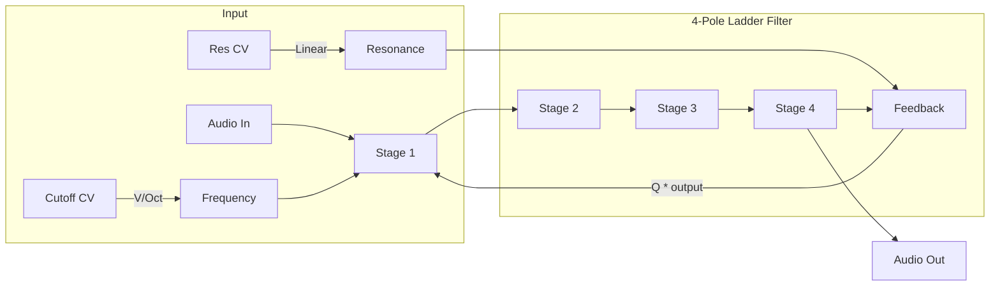

# Moog LPF

A classic 4-pole (24dB/octave) ladder lowpass filter inspired by the Moog synthesizer, with resonance and V/Oct cutoff tracking.

## Overview

Moog LPF provides the warm, musical filtering that made the Moog synthesizer legendary. The ladder topology creates a distinctive 24dB/octave rolloff with smooth resonance that can approach self-oscillation. V/Oct tracking on the cutoff allows the filter to follow melodic sequences.

Built with Faust DSP for high-quality, efficient processing.

**Width:** 4HP

## Signal Flow

## Parameters

| Knob | Range | Default | Description |
|------|-------|---------|-------------|
| **Cutoff** | 20 Hz - 20 kHz | 1 kHz | Filter cutoff frequency |
| **Resonance** | 0 - 0.95 | 0 | Filter resonance (Q). Higher values emphasize the cutoff frequency |

## Inputs

| Jack | Description |
|------|-------------|
| **Audio** | Audio signal to filter |
| **Cutoff CV** | V/Oct modulation of cutoff. 1V = 1 octave up |
| **Resonance CV** | Linear modulation of resonance. ±10V = ±0.95 |

## Outputs

| Jack | Description |
|------|-------------|
| **Audio** | Filtered audio output |

## Technical Details

- **Filter type:** 4-pole ladder lowpass (24dB/octave)
- **Resonance:** 0 to 0.95 (stays stable, won't self-oscillate)
- **CV response:**
  - Cutoff CV: Exponential (V/Oct), 1V = double frequency
  - Resonance CV: Linear, ±10V spans full range
- **Audio range:** ±5V input/output

## Patch Ideas

### Classic Subtractive
1. Connect saw wave from Super Oscillator
2. Set Cutoff to 500-1000 Hz
3. Modulate Cutoff CV with envelope for "pluck" sounds
4. Add slight Resonance (0.3-0.5) for extra character

### Filter Sweep
1. Connect any audio source
2. Patch slow LFO to Cutoff CV
3. Creates classic filter sweep effect
4. Try different LFO shapes for different characters

### Keyboard Tracking
1. Connect keyboard/sequencer V/Oct to both oscillator and Cutoff CV
2. Filter opens proportionally as pitch rises
3. Creates consistent timbre across the keyboard

### Bass Enhancement
1. Set Cutoff low (100-200 Hz)
2. Add moderate Resonance (0.5-0.7)
3. Boosts bass frequencies while rolling off highs
4. Great for kicks and bass sounds

### Resonant Ping
1. Set Resonance near maximum (0.9)
2. Set Cutoff to desired pitch
3. Send short trigger/impulse to audio input
4. Filter "rings" at cutoff frequency
