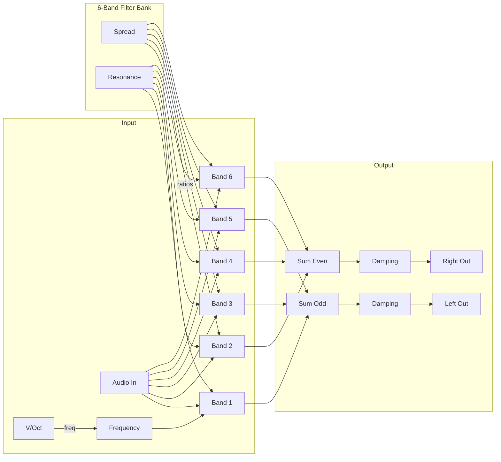

# Spectral Resonator

A 6-band resonant filter bank that transforms noise, drums, or simple waveforms into lush melodic chords through sympathetic resonance.

## Overview

Spectral Resonator contains six parallel bandpass filters tuned to harmonic relationships. When fed noise or rich harmonic content, each filter rings at its tuned frequency, creating chord-like tones from non-pitched sources. The Spread parameter morphs between unison (all filters at the same pitch) through musical intervals to complex chord voicings.

Inspired by modules like 4ms Spectral Multiband Resonator and Mutable Instruments Rings.

Built with Faust DSP for high-quality resonant filtering.

**Width:** 4HP

## Signal Flow

## Parameters

| Knob | Range | Default | Description |
|------|-------|---------|-------------|
| **Frequency** | 0 - 10V | 4V | Center pitch in V/Oct (0V = A2 110Hz) |
| **Spread** | 1.0 - 3.0 | 1.5 | Interval spread between bands |
| **Q** | 1 - 100 | 50 | Resonance of each band |
| **Damp** | 1 - 20 kHz | 10 kHz | Global high-frequency damping |

## Inputs

| Jack | Description |
|------|-------------|
| **Audio** | Mono audio input (noise, drums, or any source) |
| **V/Oct** | 1V/octave pitch CV, added to Frequency knob |
| **Spread CV** | Modulates spread. ±5V = ±1.0 spread |

## Outputs

| Jack | Description |
|------|-------------|
| **Left** | Odd bands (1, 3, 5) summed |
| **Right** | Even bands (2, 4, 6) summed |

## Understanding the Parameters

### Frequency
Sets the fundamental pitch for the filter bank:
- Combined with V/Oct input for keyboard tracking
- All 6 bands tune relative to this frequency
- Range covers bass through high treble

### Spread
Controls the frequency ratios between bands:
- **1.0:** All bands at unison (fundamental only)
- **1.5:** Approximately fifth intervals (power chord feel)
- **2.0:** Octave intervals (rich but consonant)
- **2.5-3.0:** Complex intervals (dense, dissonant chords)

### Q (Resonance)
How sharply each band resonates:
- **Low (1-20):** Broad, fuzzy resonance
- **Medium (20-60):** Musical ringing
- **High (60-100):** Sharp, bell-like resonance with long decay

### Damp
High-frequency rolloff applied globally:
- **Low (1-5 kHz):** Dark, muted character
- **Medium (5-10 kHz):** Balanced tone
- **High (10-20 kHz):** Bright, airy character

## Stereo Output

The six bands are distributed:
- **Left output:** Bands 1, 3, 5 (odd harmonics)
- **Right output:** Bands 2, 4, 6 (even harmonics)

This creates natural stereo imaging where different harmonic content appears in each channel.

## Technical Details

- **Filter type:** Resonant bandpass (2-pole)
- **Bands:** 6 parallel filters
- **Frequency tracking:** V/Oct standard
- **Audio range:** ±5V input/output

## Patch Ideas

### Noise Chords
1. Connect white or pink noise to input
2. Set Q high (60-80)
3. Play V/Oct from keyboard
4. Noise becomes pitched chord tones

### Drum Resonator
1. Connect drum hits to input
2. Medium Q (30-50)
3. Tune to key of your song
4. Drums gain melodic character

### Sympathetic Drone
1. Connect subtle noise or very quiet audio
2. Maximum Q (100)
3. Low Spread for focused pitch
4. Creates singing, sustained drones

### Shimmer Pad
1. Connect saw/square oscillator
2. Spread at 2.0 (octaves)
3. High Q for sustained resonance
4. Modulate Spread CV slowly for movement

### Breathing Chords
1. Connect any audio source
2. Modulate Spread with slow LFO
3. Chord voicing morphs continuously
4. Creates "breathing" harmonic movement

### Strummed Effect
1. Connect noise burst or impulse
2. High Q for ringing
3. Quickly sweep Frequency or V/Oct
4. Creates strummed/plucked chord sounds
