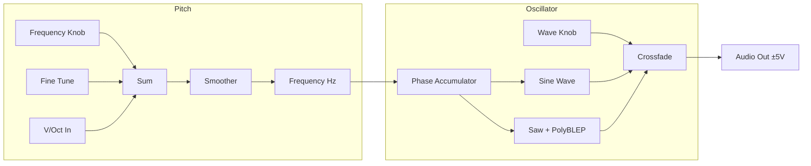

# Super Oscillator

A simple but versatile oscillator with smooth sine-to-saw morphing and precise V/Oct tracking.

## Overview

Super Oscillator is a straightforward analog-style oscillator that provides clean sine and saw waveforms with seamless morphing between them. It features anti-aliased saw wave generation using polyBLEP for pristine high-frequency content, and parameter smoothing to prevent clicks when modulating frequency.

**Width:** 3HP

## Signal Flow

## Parameters

| Knob | Range | Default | Description |
|------|-------|---------|-------------|
| **Frequency** | C1 - C9 (32.7 Hz - 8372 Hz) | C4 (261.6 Hz) | Base pitch of the oscillator |
| **Fine** | -50 to +50 cents | 0 | Fine-tune adjustment for precise detuning |
| **Wave** | 0% - 100% | 0% (Sine) | Morphs between pure sine (0%) and saw (100%) |

## Inputs

| Jack | Description |
|------|-------------|
| **V/Oct** | 1V/octave pitch control. 0V = C4, +1V = C5, etc. |

## Outputs

| Jack | Range | Description |
|------|-------|-------------|
| **Audio** | ±5V | Audio output signal |

## Technical Details

- **Anti-aliasing:** Uses polyBLEP algorithm for the saw waveform to reduce aliasing artifacts
- **Frequency smoothing:** One-pole lowpass filter on frequency changes prevents audible clicks
- **Pitch range:** Spans 9 octaves from C1 to C9
- **Output level:** ±5V peak (10Vpp)

## Patch Ideas

### Basic Subtractive Patch
1. Connect V/Oct output from a sequencer or keyboard
2. Set Wave to 100% for saw
3. Route audio through Moog LPF for classic subtractive synthesis

### Detuned Unison
1. Use two Super Oscillators
2. Set one to Fine +7 cents, the other to Fine -7 cents
3. Mix outputs for a thick, chorused sound

### Sub-Oscillator
1. Set Frequency one octave below your main oscillator
2. Keep Wave at 0% for a pure sine sub-bass
3. Mix at low volume for added weight
