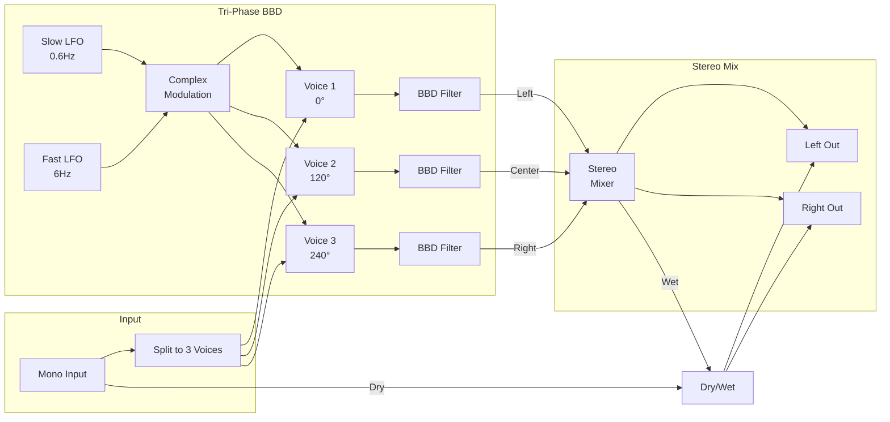

# Tri-Phase Ensemble

A classic 3-voice BBD string ensemble effect with tri-phase chorus. Transforms thin waveforms into massive, swirling orchestral string sounds.

## Overview

The Tri-Phase Ensemble effect uses three bucket-brigade delay (BBD) lines running in parallel, each modulated by LFOs that are 120° out of phase with each other. This creates the characteristic "motionless motion" - incredibly thick and moving sound without the wobbly pitch problems of standard chorus effects.

Built with Faust DSP for authentic analog-style processing.

**Width:** 4HP

## Signal Flow

## Parameters

| Knob | Range | Default | Description |
|------|-------|---------|-------------|
| **Depth** | 0% - 200% | 100% | Modulation intensity. Higher = more dramatic ensemble effect |
| **Rate** | 0.1x - 3.0x | 1.0x | LFO speed multiplier. 1.0 = original Solina speed |
| **Tone** | 500 - 20000 Hz | 8000 Hz | BBD lowpass filter. Lower = darker, more vintage |
| **Mix** | 0% - 100% | 100% | Dry/wet blend. 100% wet is traditional for ensemble effects |

## Inputs

| Jack | Description |
|------|-------------|
| **IN L** | Left audio input (summed to mono internally) |
| **IN R** | Right audio input (optional, summed with L) |
| **CV** | Mix modulation CV. ±10V = ±100% |

## Outputs

| Jack | Description |
|------|-------------|
| **L** | Left audio output |
| **R** | Right audio output |

## Understanding the Parameters

### Depth
Controls the intensity of the pitch modulation:
- **Low (0-50%):** Subtle thickening, good for adding body
- **Medium (50-100%):** Classic tri-phase ensemble sound
- **High (100-200%):** Exaggerated, dramatic swirling

### Rate
Scales both the slow (chorus) and fast (vibrato) LFOs:
- **Slow (0.1-0.5x):** Dreamy, slow-motion ensemble
- **Normal (1.0x):** Classic ensemble speed
- **Fast (2.0-3.0x):** More aggressive, vibrato-heavy sound

### Tone
Simulates the dark, murky character of vintage BBD chips:
- **Low (500-2000 Hz):** Very dark, lo-fi vintage character
- **Medium (4000-8000 Hz):** Classic warm ensemble
- **High (10000-20000 Hz):** Brighter, more modern sound

### Mix
Controls dry/wet balance:
- **0%:** Completely dry (bypass)
- **50%:** Parallel blend (adds thickness without replacing original)
- **100%:** Fully wet (traditional ensemble effect)

## Technical Details

- **Algorithm:** 3-voice BBD simulation with tri-phase LFO modulation
- **LFO Configuration:** Dual LFO (0.6Hz slow + 6Hz fast) with 120° phase offset per voice
- **Base Delay:** ~12ms (typical analog chorus range)
- **Phase Relationship:** 0°, 120°, 240° creates stable pitch center
- **Stereo Field:** Voice 1 left, Voice 2 center, Voice 3 right

## Why It Sounds "Orchestral"

Standard chorus effects use a single delay line with pitch modulation, which creates obvious pitch wobble. The tri-phase design works differently:

1. **Three voices** modulated 120° apart
2. When one voice pitches up, another pitches down, and the third stabilizes
3. The "center of gravity" of pitch remains constant
4. Result: massive thickness and movement without sounding out of tune

This is the definitive sound of 1970s string machines.

## Patch Ideas

### Classic String Pad
1. Feed a sawtooth oscillator into the input
2. Depth at 100%, Rate at 1.0x
3. Tone around 6000 Hz
4. Mix at 100%
5. Add Big Reverb for lush strings

### Synth Brass Thickening
1. Feed brass/lead sound into input
2. Lower Depth (40-60%)
3. Mix at 50% for parallel processing
4. Adds body without overwhelming the original

### Vintage Electric Piano
1. Feed clean piano/keys sound
2. Depth at 80%, Rate at 0.8x
3. Tone at 4000 Hz for warm vintage character
4. Classic 70s electric piano chorus

### Ambient Pad Washer
1. Feed any pad or drone
2. High Depth (150-200%)
3. Slow Rate (0.3-0.5x)
4. Creates evolving, watery textures

### Guitar Ensemble
1. Feed guitar or plucked sounds
2. Moderate Depth (60-80%)
3. Rate at 1.2x for slightly faster movement
4. 12-string guitar-like thickness
