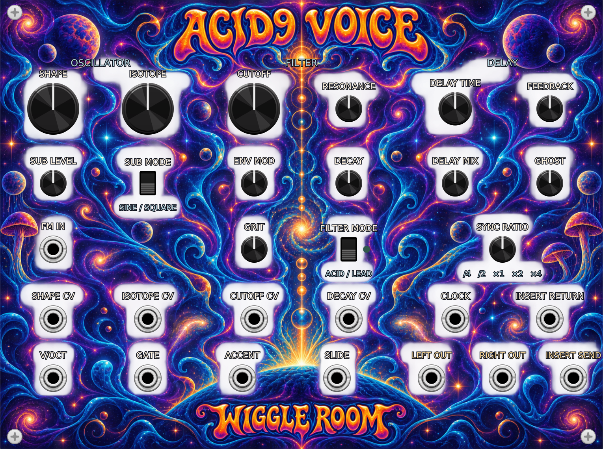

# ACID9 Voice

ACID9 Voice is a monophonic acid synth with a stereo oscillator, two filter characters, accent, slide, an insert loop and stereo delay. It occupies **34HP**. This is the only module in WiggleRoom 2.1.1; Matter and the other experimental modules are deferred.

## First sound

1. Connect a sequencer's pitch output to **V/OCT** and gate to **GATE**.
2. Connect **LEFT** and **RIGHT** to an audio output module. Start at a low monitoring level.
3. Load **Classic acid** from the module's Factory presets menu, or use the default settings.
4. Turn **CUTOFF**, **RESONANCE**, **ENV MOD** and **DECAY** while playing notes.
5. Add **GRIT** for saturation, **ISOTOPE** for stereo spread, and **DELAY MIX** for echoes.

The included [MIDI example patch](../../../examples/ACID9-first-sound.vcv) uses only ACID9 Voice and Rack's built-in MIDI-CV and Audio-2 modules. Select your MIDI input and audio output devices in those modules. No audio hardware settings are embedded in the patch.

## Controls

| Section | Control | Behaviour |
|---|---|---|
| Oscillator | Shape | Morphs the oscillator waveform. |
| Oscillator | Isotope | Adds detune and stereo spread to the three oscillator cores. |
| Oscillator | Sub level / Sub mode | Adds an octave-down oscillator; switch between sine and square. |
| Filter | Cutoff | Base cutoff, 20Hz–20kHz. |
| Filter | Resonance | Emphasises the cutoff region. |
| Filter | Env mod | Bipolar filter envelope amount; negative values close the filter. |
| Filter | Decay | Filter envelope decay, 10ms–2s. |
| Filter | Grit | Saturation before the filter. |
| Filter | Filter mode | ACID or LEAD filter character. The light is on for LEAD. |
| Delay | Delay time | Manual left delay, 10–2000ms. The right delay is 5% longer. |
| Delay | Feedback | Repeat amount, internally limited to 0.95. |
| Delay | Delay mix | Dry/wet balance. Zero is completely dry. |
| Delay | Ghost | Raises the delay high-pass cutoff from 80Hz to 480Hz, making repeats thinner. |
| Delay | Sync ratio | Clock period × ¼, ½, 1, 2 or 4, constrained to the delay time range. |

## Inputs and outputs

Only the first channel of polyphonic inputs is used.

| Jack | Signal |
|---|---|
| V/OCT | Pitch, 1V/octave; 0V is approximately C4. Accepted range −5V to +10V, with oscillator frequency limited internally. |
| Gate | Holds the voice open above approximately 0.9V, with a short smoothing stage. |
| Accent | Above 0.9V, increases filter envelope depth and loudness. |
| Slide | Above 0.9V, changes pitch smoothing from approximately 1ms to 60ms. |
| Cutoff CV | Adds exponential cutoff modulation, 1V/octave, clamped to ±5V. |
| FM in | Pitch modulation: 1V changes pitch by 0.1 octave, clamped to ±5V. |
| Shape CV / Isotope CV | Added to the knob setting; +10V spans the full control range. |
| Decay CV | Added to the knob setting; +5V adds 1s. The result is clamped to 10ms–2s. |
| Clock | Rising edges above 0.5V. Two edges establish tempo; periods of 100 samples or less are ignored. Sync expires after 2s without an edge or when unplugged. |
| Send | Mono voice signal after the filter and VCA, before delay. |
| Insert return | Mono return replaces the internal stereo voice before the delay. Unpatched, the internal voice passes through. |
| Left / Right | Stereo audio, softly limited toward ±5V. |

To insert an effect, connect **SEND → effect input → effect output → INSERT RETURN**. Connecting a silent return mutes the dry voice, while Send remains active. Delay repeats can continue after a note ends.

## Timing and patch behaviour

A clock overrides the Delay time knob only after two valid edges. Unplugging or stopping the clock returns to manual time. Changing the sample rate or resetting the module clears the delay and sync state. Patch save/load restores controls; active delay tails are not saved.

The filter envelope has an 8ms attack. The amplitude envelope uses an 8ms attack and approximately 150ms release, so this voice is deliberately smoother than an instantaneous gate.

## Compatibility

WiggleRoom 2.1.1 retains the `WiggleRoom/ACID9Voice` slug and existing parameter/port IDs. The panel has grown from 20HP to 34HP; leave space or rearrange neighbours when opening older development patches. Patches using deferred WiggleRoom modules require the development build that supplied them.

## Source and licence

GPL-3.0-or-later. DSP source and the generated header are included. The cosmic artwork uses AI-generated illustration and branding with separately drawn functional labels; it is not affiliated with the Grateful Dead.
