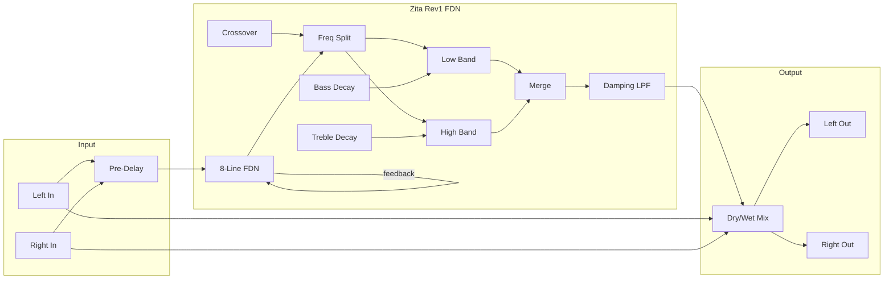

# Big Reverb

A lush stereo reverb using the renowned Zita Rev1 algorithm, featuring independent bass and treble decay times for rich, natural-sounding spaces.

## Overview

Big Reverb implements a high-quality 8-line feedback delay network (FDN) reverb based on the Zita Rev1 algorithm by Fons Adriaensen. Unlike simple reverbs, it provides independent control over low and high frequency decay times, allowing you to create everything from tight, controlled rooms to massive, evolving halls.

Built with Faust DSP for pristine audio quality.

**Width:** 4HP

## Signal Flow

## Parameters

| Knob | Range | Default | Description |
|------|-------|---------|-------------|
| **Bass Decay** | 0.1 - 60 seconds | 3s | Decay time for low frequencies |
| **Treble Decay** | 0.1 - 20 seconds | 2s | Decay time for high frequencies |
| **Pre-Delay** | 0 - 200 ms | 20ms | Gap before reverb starts |
| **Damping** | 100 Hz - 15 kHz | 5 kHz | High-frequency rolloff in the reverb tail |
| **Crossover** | 50 Hz - 6 kHz | 200 Hz | Frequency split between bass and treble decay |
| **Mix** | 0% - 100% | 50% | Dry/wet balance |

## Inputs

| Jack | Description |
|------|-------------|
| **Left** | Left channel audio input |
| **Right** | Right channel audio input (uses Left if unconnected) |
| **Mix CV** | Modulates dry/wet mix. 10V = full wet |

## Outputs

| Jack | Description |
|------|-------------|
| **Left** | Left channel reverb output |
| **Right** | Right channel reverb output |

## Understanding the Parameters

### Bass Decay & Treble Decay
These work together to shape the character of the space:
- **Bass > Treble:** Warm, boomy spaces (cathedrals, large halls)
- **Bass = Treble:** Natural, balanced rooms
- **Bass < Treble:** Tight, controlled reverb (studios, small rooms)

### Pre-Delay
The time between dry signal and reverb onset:
- **0-20ms:** Intimate, close sound
- **20-50ms:** Natural room sound
- **50-200ms:** Large hall effect, adds depth without washing out transients

### Damping
Controls how quickly high frequencies decay within the reverb:
- **Low (1-3 kHz):** Dark, vintage character
- **Medium (3-8 kHz):** Natural room acoustics
- **High (8-15 kHz):** Bright, airy spaces

### Crossover
Sets the frequency where bass and treble decay settings split:
- **Low (50-100 Hz):** Only sub-bass gets longer decay
- **Medium (100-500 Hz):** Classic split point
- **High (500 Hz - 6 kHz):** More frequencies use bass decay setting

## Technical Details

- **Algorithm:** Zita Rev1 (8-line FDN)
- **Pre-delay:** Up to 200ms
- **Frequency response:** Full bandwidth, no coloration
- **Stereo:** True stereo processing
- **Audio range:** ±5V input/output

## Patch Ideas

### Lush Pad Reverb
1. Set Bass Decay to 8-10 seconds
2. Set Treble Decay to 4-5 seconds
3. Pre-Delay at 40ms
4. Mix at 40-50%
5. Creates expansive, evolving pad textures

### Tight Drum Room
1. Bass Decay at 0.5s, Treble Decay at 0.3s
2. Pre-Delay at 10ms
3. Mix at 20-30%
4. Adds body without washing out transients

### Cathedral
1. Bass Decay at 20+ seconds
2. Treble Decay at 6-8 seconds
3. Pre-Delay at 80-100ms
4. Low Damping (2-3 kHz)
5. Massive, dark reverb for ambient music

### Spring Emulation
1. Short decay times (0.5-1s both)
2. High Damping (10-15 kHz)
3. Pre-Delay at 30-50ms
4. High Mix for drippy spring character

### Sidechain Reverb
1. Set Mix to 100% (full wet)
2. Use VCA before reverb, ducked by kick drum
3. Reverb swells between hits
4. Classic EDM/pop production technique
