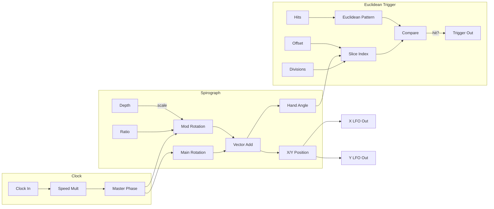

# Cycloid

A polar Euclidean sequencer with spirograph-style warping. A rotating clock hand triggers when crossing polygon vertices, creating complex rhythmic patterns with beautiful visualizations.

## Overview

Cycloid combines Euclidean rhythm generation with spirograph mathematics. A clock hand rotates around a circle divided into segments, triggering whenever it crosses a "hit" vertex defined by the Euclidean algorithm. The spirograph warping adds a secondary rotation that creates complex, evolving timing variations while outputting smooth X/Y LFO signals.

**Width:** 12HP

## Signal Flow

## How It Works

1. The circle is divided into N segments (Divisions)
2. The Euclidean algorithm places K active vertices (Hits) evenly around the circle
3. A clock hand rotates around the circle, driven by clock input or internal tempo
4. When the hand crosses an active vertex, a trigger is generated
5. The spirograph Depth and Ratio parameters add a secondary rotation, warping the hand's path

The display shows the rotating hand, active vertices (bright), inactive vertices (dim), and optionally a spirograph trail showing the warped path.

## Parameters

| Control | Range | Default | Description |
|---------|-------|---------|-------------|
| **Speed** | /8 to x8 | x1 | Clock division/multiplication for rotation speed |
| **Divisions** | 1 - 32 | 8 | Number of segments around the circle |
| **Hits** | 1 - 32 | 4 | Number of active trigger vertices (Euclidean distribution) |
| **Offset** | 0 - 1 turn | 0 | Rotates the pattern around the circle |
| **Ratio** | 1:2 to 8:1 | 2:1 | Ratio of secondary to primary rotation |
| **Depth** | 0% - 100% | 0% | Amount of spirograph warping |
| **Hits CV** | -100% to +100% | 0% | Attenuverter for Hits CV input |
| **Depth CV** | -100% to +100% | 0% | Attenuverter for Depth CV input |

## Inputs

| Jack | Description |
|------|-------------|
| **Clock** | External clock. Uses internal 120 BPM if unconnected |
| **Reset** | Resets rotation to starting position |
| **Hits CV** | Modulates number of active hits |
| **Depth CV** | Modulates spirograph depth |

## Outputs

| Jack | Range | Description |
|------|-------|-------------|
| **Trigger** | 0V / 10V | 1ms trigger on each hit vertex crossing |
| **X** | ±5V | Spirograph X-axis position (cosine-based LFO) |
| **Y** | ±5V | Spirograph Y-axis position (sine-based LFO) |

## Understanding the Display

- **Outer circle:** The sequencer boundary
- **Dim dots:** All division points
- **Bright pink dots:** Active hit vertices (will trigger)
- **Pink spokes:** Lines from center to active hits
- **Cyan hand:** Current rotation position
- **Cyan trail:** Spirograph path (when Depth > 0)
- **Orange flash:** Trigger event

## Euclidean Rhythms

The Euclidean algorithm distributes K hits as evenly as possible across N steps. Classic patterns include:

| Divisions | Hits | Pattern | Musical Use |
|-----------|------|---------|-------------|
| 8 | 3 | x..x..x. | Tresillo |
| 8 | 5 | x.xx.xx. | Cinquillo |
| 16 | 5 | x..x..x..x..x... | Bossa nova |
| 12 | 7 | x.xx.x.xx.x. | West African bell |

## Spirograph Warping

When Depth > 0, the hand follows a spirograph curve instead of a simple circle:

- **Depth 0%:** Pure circular motion (standard Euclidean)
- **Depth 50%:** Moderate warping, creates timing "push and pull"
- **Depth 100%:** Maximum warping, complex looping patterns

The **Ratio** parameter controls the relationship between primary and secondary rotations:
- **1:1:** Simple loop
- **2:1:** Two loops per rotation (classic spirograph)
- **3:1, 4:1, etc.:** More complex, flower-like patterns

## Patch Ideas

### Classic Euclidean Drums
1. Set Divisions to 16, Hits to 5
2. Clock at your tempo
3. Use trigger for kick drum, offset another Cycloid for snare

### Evolving Rhythms
1. Set a base Euclidean pattern
2. Slowly modulate Hits with a very slow LFO
3. Pattern gradually morphs between related rhythms

### Spirograph LFO
1. Ignore the trigger output
2. Set Depth to 50-75%
3. Use X and Y outputs as complex, related LFOs
4. Great for filter cutoff + resonance modulation

### Polyrhythmic Triggers
1. Use two Cycloids with the same clock
2. Set different Divisions (e.g., 8 and 12)
3. Creates interlocking polyrhythmic patterns

### Generative Chaos
1. Modulate Depth with audio-rate signal
2. Creates semi-random trigger timing
3. Use X/Y for companion modulation
