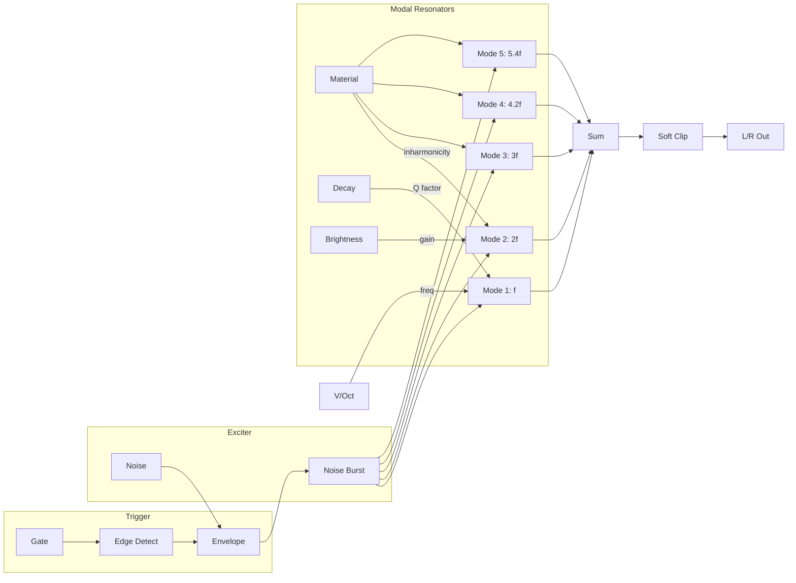

# Modal Bell

A physical model of a struck bar that produces vibraphone, marimba, and bell-like sounds through modal synthesis.

## Overview

Modal Bell uses physical modeling to simulate a struck metal or wooden bar. Unlike sample-based instruments, the sound is generated in real-time based on the physics of vibrating materials. This creates organic, expressive tones that respond naturally to playing dynamics and can produce sounds impossible with traditional synthesis.

Built with Faust DSP for efficient modal synthesis.

**Width:** 4HP

## Signal Flow

## Parameters

| Knob | Range | Default | Description |
|------|-------|---------|-------------|
| **Decay** | 0.1 - 5 seconds | 0.5s | How long the sound rings after being struck |
| **Brightness** | 0% - 100% | 50% | Controls the high-frequency content (mallet hardness) |
| **Material** | 0 - 1 | 0.5 | Morphs between different material types |

## Inputs

| Jack | Description |
|------|-------------|
| **V/Oct** | Pitch control. 0V = C4, standard 1V/octave |
| **Gate** | Trigger input. Strikes the bar when voltage exceeds ~1V |

## Outputs

| Jack | Description |
|------|-------------|
| **Left** | Left channel audio output |
| **Right** | Right channel audio output |

## Understanding the Parameters

### Decay
Controls how long the bar resonates after being struck:
- **Short (0.1-0.5s):** Muted, percussive tones like a dampened xylophone
- **Medium (0.5-2s):** Natural vibraphone or marimba sustain
- **Long (2-5s):** Singing, bell-like sustain

### Brightness
Simulates mallet hardness:
- **Low (0-30%):** Soft mallets, warm and mellow like rubber mallets on marimba
- **Medium (30-70%):** Balanced attack and body
- **High (70-100%):** Hard mallets, bright attack like metal on metal

### Material
Morphs the harmonic structure between material types:
- **Low values:** More wood-like, inharmonic overtones (marimba, xylophone)
- **Mid values:** Metallic but warm (vibraphone)
- **High values:** Bell-like, bright and ringing (tubular bells, chimes)

## Technical Details

- **Synthesis type:** Modal (additive resonant modes)
- **Polyphony:** Monophonic (one voice)
- **Output level:** ±5V peak
- **Stereo field:** Natural stereo imaging based on mode distribution

## Patch Ideas

### Classic Vibraphone
1. Set Decay to 2-3 seconds
2. Brightness around 40%
3. Material at 0.5
4. Play with keyboard or sequencer

### Marimba Bass
1. Set V/Oct to lower octaves (negative voltage)
2. Decay at 0.5-1 second
3. Low Brightness (20-30%)
4. Material low (0.2-0.3)

### Ethereal Bells
1. Set Decay to maximum (5s)
2. High Brightness (80%)
3. Material high (0.8-1.0)
4. Use sparse triggers for ambient textures

### Percussive Mallet
1. Very short Decay (0.1-0.2s)
2. High Brightness for attack
3. Great for rhythmic patterns
4. Layer with drum sounds

### Evolving Timbres
1. Modulate Material with slow LFO
2. Sound morphs between wood and metal characteristics
3. Creates organic, evolving bell tones
