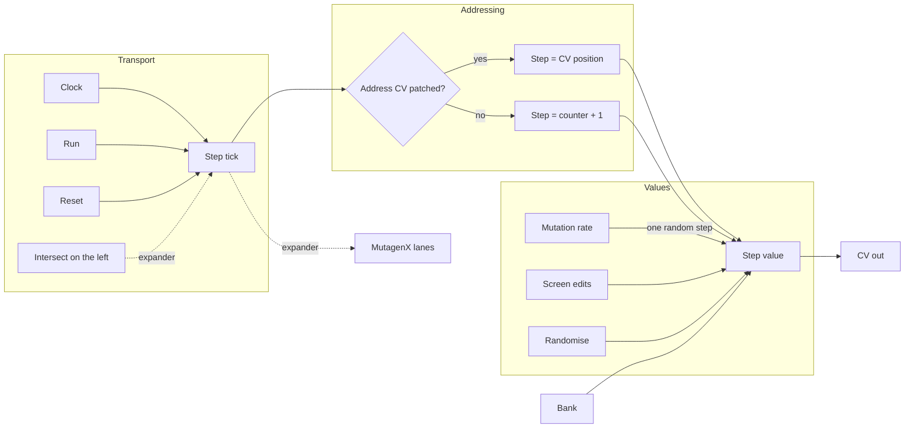

# Mutagen

A step sequencer with no per-step knobs. Values arrive by randomising, then drift under a mutation rate, and you draw on the screen when you want to intervene.

## Overview

Most sequencers ask you to dial in every step. Mutagen does the opposite: press Randomise for a fresh set of values, set a mutation rate, and let the pattern evolve while it plays. The screen is a live editor, so you can reach in and shape any step by hand at any point.

Steps run top to bottom and the value is the length of each bar, which is what lets the whole thing fit in 6HP.

**Width:** 6HP

## Signal Flow

## How It Works

1. On each clock tick the sequencer picks a step. With nothing in **Address CV** it advances by one and wraps at the step count.
2. With **Address CV** patched, the voltage selects the step outright: 0V is the first step, 10V the last. The address is read **only on the clock tick**, so a smooth LFO or envelope still produces stepped, in-time output rather than a continuous slide.
3. Also on each tick, the **Mutation Rate** knob is the probability that one randomly chosen step takes a new random value. At 0% the pattern is fixed; at 100% a step changes every single tick.
4. The selected step's value becomes the **CV** output, 0V to 10V.

## Parameters

| Control | Range | Default | Description |
|---------|-------|---------|-------------|
| **Steps** | 1 to 64 | 8 | Pattern length |
| **Mutate** | 0% to 100% | 0% | Chance per clock that one random step is rewritten |
| **Bank** | 0 to 15 | 0 | Selects a stored slot. Changing it recalls that slot |
| **Save** | button | | Stores the current values into the selected bank |
| **Rand** | button | | Rewrites every active step with a new random value |

## Inputs

| Jack | Description |
|------|-------------|
| **Clk** | Clock. Ignored when an Intersect is supplying the chain from the left |
| **Run** | Gate. High or unpatched runs; low holds the sequence still |
| **Rst** | Returns to the first step |
| **Addr** | Address CV, 0V to 10V across the pattern. Sampled on the clock tick |

## Outputs

| Jack | Range | Description |
|------|-------|-------------|
| **CV Out** | 0V to 10V | The current step's value. Switchable to -5V to 5V in the right-click menu |

## The Screen

Steps run top to bottom, one row each. The bar length is the value. The row outlined in gold is the step currently sounding, and nothing is outlined until the first clock tick arrives.

Click anywhere to set that step, and drag to sweep a shape across several steps in one gesture. A drag counts as a single edit for undo.

## Banks

Sixteen slots. **Save** writes the current values into the selected slot; turning **Bank** to a different slot recalls it. An empty slot leaves the pattern alone rather than blanking it, so you can page through banks safely.

Every module in a chain owns its own storage. Mutagen broadcasts only the slot number, so a bank change reshapes every lane at once while each keeps its own material.

## Working With Intersect

Place an **Intersect** directly to the left and Mutagen takes clock, run and reset from it with no cables. Intersect's trigger output is the clock, so Mutagen advances on Intersect's band crossings rather than on a steady pulse. Its own Clk, Run and Rst jacks take over whenever no Intersect is attached.

Note that Intersect gained a **Run** input for this. Unpatched it runs as before.

## Multi-Lane Sequencing

Add [MutagenX](MutagenX.md) expanders to the right for more lanes. Each has its own values, its own screen and its own CV output, but follows the same clock, the same step address and the same bank.

Give a MutagenX a different step count and it wraps the shared address into its own length, so an 8-step master against a 5-step lane phases the two patterns against each other.

## Patch Ideas

### Generative Melody That Drifts
1. Clock Mutagen from your master clock
2. Randomise, set Steps to 8, and quantise the output with The Architect
3. Set Mutate to about 15%. The line keeps its shape while single notes shift
4. Save a version you like to a bank before letting it drift further

### CV-Addressed Scrubbing
1. Patch a slow LFO into **Addr**
2. The sequence is now read out of order, but still strictly on the clock
3. Sweep the LFO by hand to jump around the pattern

### Four Lanes From One Clock
1. Intersect, then Mutagen, then three MutagenX, all touching
2. Set lengths of 8, 5, 7 and 3 for a pattern that takes 840 steps to repeat
3. Use one lane for pitch, one for filter cutoff, one for level, one for a slow drift
