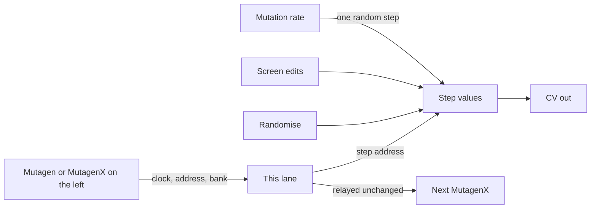

# Mutagen X

An extra sequencer lane for [Mutagen](Mutagen.md). Its own values, its own screen, its own CV output, locked to the same clock and step address.

## Overview

Mutagen X has no transport or bank controls of its own. It takes clock, run, reset, the current step address and the bank number from the chain on its left, and passes the same information on to its right. Stack as many as you like.

What it does own is its material: a separate set of step values, its own mutation rate, and its own screen you can draw on. So a chain of four gives you four independent CV lanes moving in lockstep.

**Width:** 4HP

## Signal Flow

## How It Works

1. It must sit immediately to the right of a Mutagen, or of another Mutagen X. The **link light** confirms it is receiving.
2. On each clock tick from the chain it reads the broadcast step address, wraps it into its own step count, and outputs that step's value.
3. Its own **Mutate** knob applies independently, so one lane can be frozen while another drifts.
4. A bank change on the master recalls **this module's own** slot for that number, so the whole chain reshapes together while each lane keeps its own material.

## Parameters

| Control | Range | Default | Description |
|---------|-------|---------|-------------|
| **Steps** | 1 to 64 | 8 | This lane's pattern length, independent of the master |
| **Mutate** | 0% to 100% | 0% | Chance per clock that one random step here is rewritten |
| **Rand** | button | | Rewrites every active step in this lane |

## Inputs

None. Everything arrives over the expander connection.

## Outputs

| Jack | Range | Description |
|------|-------|-------------|
| **CV Out** | 0V to 10V | This lane's current step value. Switchable to -5V to 5V in the right-click menu |

## Different Lengths

The step address is broadcast as a number and each lane wraps it into its own length. Matching lengths run in lockstep. Set this lane shorter or longer than the master and the two patterns phase against each other, which is the cheapest way to get a long evolving cycle out of a short clock.

Lengths of 8, 5, 7 and 3 across four lanes repeat only every 840 steps.

## Notes

- The link light is dark when there is no valid chain to the left. Check the module is touching its neighbour with nothing between them.
- Save is driven from the master. Pressing Save there stores every lane at once, each into its own slot.
- The chain is relayed unchanged, so a Mutagen X in the middle never blocks the ones after it.
