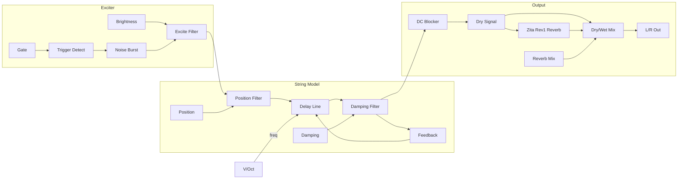

# Plucked String

A Karplus-Strong physical model that creates realistic guitar, harp, and plucked instrument sounds through filtered delay feedback.

## Overview

Plucked String uses the classic Karplus-Strong algorithm to simulate a vibrating string. A burst of noise (the "pluck") excites a delay line with filtered feedback, creating the characteristic decaying tone of plucked instruments. The position and brightness controls shape the initial harmonic content, while damping controls how quickly the sound decays.

Built with Faust DSP for efficient physical modeling.

**Width:** 4HP

## Signal Flow

## Parameters

| Knob | Range | Default | Description |
|------|-------|---------|-------------|
| **Damping** | 0% - 100% | 30% | String damping. Low = bright/long sustain, High = muted/short decay |
| **Position** | 1% - 99% | 50% | Pluck position. Low = near bridge (bright), High = near middle (mellow) |
| **Brightness** | 0% - 100% | 50% | Excitation brightness. Controls initial attack character |
| **Reverb** | 0% - 100% | 30% | Built-in stereo reverb mix. 0% = dry, 100% = fully wet |

## Inputs

| Jack | Description |
|------|-------------|
| **V/Oct** | Pitch control. 0V = C4, standard 1V/octave |
| **Gate** | Trigger input. Plucks the string when voltage rises above 1V |
| **Damp CV** | Modulates damping. ±10V = ±100% |
| **Pos CV** | Modulates pluck position. ±10V = ±100% |
| **Bright CV** | Modulates excitation brightness. ±10V = ±100% |
| **Verb CV** | Modulates reverb mix. ±10V = ±100% |

## Outputs

| Jack | Description |
|------|-------------|
| **L** | Left audio output |
| **R** | Right audio output |

## Understanding the Parameters

### Damping
Controls both tone and decay time:
- **Low (0-30%):** Bright, ringing tone with long sustain (nylon guitar, harp)
- **Medium (30-60%):** Balanced decay (acoustic guitar)
- **High (60-100%):** Muted, short decay (palm-muted guitar, muted strings)

### Position
Simulates where on the string you pluck:
- **Low (near bridge):** Bright, twangy tone with more harmonics
- **Middle (50%):** Balanced, natural guitar tone
- **High (near middle):** Mellow, fundamental-heavy tone (classical technique)

### Brightness
Controls the excitation spectrum:
- **Low:** Soft attack, like a thumb pluck or felt pick
- **High:** Sharp attack, like a hard pick or fingernail

### Reverb
Built-in Zita Rev1 stereo reverb:
- **Low (0-20%):** Dry or slight room ambience
- **Medium (30-50%):** Natural space, good for solo instrument
- **High (60-100%):** Lush, ambient textures (great for harp and pad sounds)

## Technical Details

- **Algorithm:** Karplus-Strong (filtered delay feedback)
- **Delay range:** 2-4000 samples (~12Hz to ~24kHz at 48kHz sample rate)
- **Filter:** One-pole lowpass in feedback loop
- **Trigger:** Rising edge detection at 1V threshold
- **Reverb:** Zita Rev1 stereo algorithm with dry/wet mix
- **Output:** Stereo

## Patch Ideas

### Acoustic Guitar
1. Set Damping to 30-40%
2. Position at 40-50%
3. Brightness at 50-60%
4. Sequence with keyboard or sequencer

### Harp Glissando
1. Low Damping (10-20%) for long sustain
2. Position at 60% for mellow tone
3. Use arpeggiator or sequencer
4. Turn up built-in Reverb (60-80%) for lush harp sound

### Palm-Muted Metal
1. High Damping (70-80%)
2. Position low (20-30%) for punch
3. High Brightness for attack
4. Fast gate sequences for chugging

### Plucked Bass
1. Octave down from V/Oct source
2. Medium Damping (40-50%)
3. Position high (60-70%) for deep tone
4. Layer with Sub oscillator

### Evolving Texture
1. Modulate Damping with slow LFO
2. Random gates from sequencer
3. Add delay and reverb
4. Creates organic, evolving plucked textures

### Prepared Piano Effect
1. Modulate Position with audio-rate signal
2. Creates metallic, prepared piano tones
3. Experiment with different modulation sources
