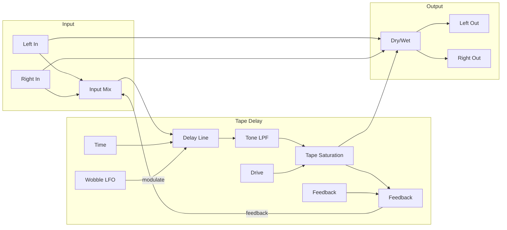

# Saturation Echo

A vintage tape delay emulation with saturation and wobble in the feedback loop, creating warm, organic echoes that degrade naturally with each repeat.

## Overview

Saturation Echo captures the magic of vintage tape delays where each repeat passes through the tape mechanism, gaining warmth, losing high frequencies, and picking up subtle pitch variations. The result is echoes that feel alive and musical, unlike sterile digital delays.

Features self-oscillation capability for creating drones and sound design, plus CV control over time and feedback for performance expression.

Built with Faust DSP for authentic tape character.

**Width:** 4HP

## Signal Flow

## Parameters

| Knob | Range | Default | Description |
|------|-------|---------|-------------|
| **Time** | 1 - 1000 ms | 350ms | Delay time |
| **Feedback** | 0% - 110% | 50% | Amount of signal fed back. Above 100% creates self-oscillation |
| **Tone** | 100 Hz - 15 kHz | 4 kHz | Lowpass filter in feedback loop |
| **Drive** | 0% - 100% | 20% | Tape saturation amount |
| **Wobble** | 0 - 10 ms | 0ms | Tape flutter/wow depth |
| **Mix** | 0% - 100% | 50% | Dry/wet balance |

## Inputs

| Jack | Description |
|------|-------------|
| **Left** | Left channel audio input |
| **Right** | Right channel audio input (mono if unconnected) |
| **Time CV** | Modulates delay time. 1V = +100ms |
| **Feedback CV** | Modulates feedback. 1V = +10% |

## Outputs

| Jack | Description |
|------|-------------|
| **Left** | Left channel output |
| **Right** | Right channel output |

## Understanding the Parameters

### Time
Sets the delay time between repeats:
- **Short (1-100ms):** Slapback, doubling effects
- **Medium (100-400ms):** Classic echo, rhythmic delays
- **Long (400-1000ms):** Spacious, ambient delays

### Feedback
Controls how many repeats occur:
- **0-30%:** Single slapback or short tail
- **30-70%:** Multiple repeats that fade naturally
- **70-100%:** Long, sustained echoes
- **100-110%:** Self-oscillation - echoes build instead of decay

### Tone
Lowpass filter in the feedback loop:
- Each repeat loses more high frequencies
- **Low settings (1-3 kHz):** Dark, warm repeats like worn tape
- **High settings (8-15 kHz):** Brighter, more pristine repeats

### Drive
Tape saturation intensity:
- **0-20%:** Subtle warmth and compression
- **20-50%:** Noticeable harmonic richness
- **50-100%:** Heavy saturation, gritty character

### Wobble
Simulates tape motor instability:
- **0ms:** Clean, stable pitch
- **1-3ms:** Subtle, natural tape character
- **3-10ms:** Obvious wobble, lo-fi effect

## Technical Details

- **Delay range:** 1ms to 1 second
- **Feedback:** Allows self-oscillation above 100%
- **Saturation:** Soft-clipping tape emulation
- **Modulation:** Sine-wave LFO for wobble effect
- **Stereo:** True stereo with mono compatibility
- **Audio range:** ±5V input/output

## Patch Ideas

### Classic Dub Delay
1. Time at 300-400ms (sync to tempo)
2. Feedback at 60-70%
3. Tone at 2-3 kHz (dark repeats)
4. Drive at 30%
5. Automate Feedback CV for builds

### Tape Slapback
1. Time at 80-120ms
2. Feedback at 20-30%
3. Low Drive for subtle warmth
4. Classic rockabilly/country sound

### Self-Oscillating Drone
1. Set Feedback above 100%
2. Low Tone for dark drones
3. Modulate Time CV for pitch bends
4. Great for ambient intros/outros

### Lo-Fi Texture
1. High Wobble (5-8ms)
2. High Drive (60-80%)
3. Low Tone (1-2 kHz)
4. Creates degraded, worn tape character

### Rhythmic Modulation
1. Sync Time to tempo division
2. Modulate Feedback with rhythmic CV
3. Creates pumping, dynamic echoes
4. Great for electronic music
