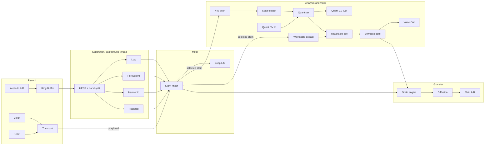

# Stems

Records a few bars of audio, splits it into four beat-synced layers, and plays those layers three ways at once: as loops, as the source material for a morphing wavetable voice, and as the pitch reference for a scale-detecting quantiser. The loop and the voice are then mixed into a granular texturiser.

## Overview

Feed Stems anything with a pulse and it becomes an accompaniment built from that material. Recording is clocked, so the loop stays locked to your patch rather than drifting. Separation runs on a background thread and splits the take into Low, Percussive, Harmonic and Residual layers you can mix independently.

The same layers drive the rest of the module. One of them is selected as the analysis source: its pitch content sets the detected key, which the quantiser snaps incoming CV to, and a window of it becomes the oscillator's wavetable. So the synth voice inherits the harmonic fingerprint of what you recorded and sits in key with the loop rather than against it.

It is designed to be left running and nudged. Character depends entirely on what you feed it: field recordings become drifting drones, drum loops become pitched metallic sequences.

**Width:** 34HP

## Signal Flow

## Controls

### Record and transport

| Control | What it does |
|---------|--------------|
| Arm | Starts and stops recording. Releasing it ends the take and begins separation |
| Mode | Trigger, threshold, or overdub |
| Thresh | Input level that starts recording in threshold mode |
| Bars | Buffer length in bars, quantised to the clock |
| Div | Clock division. Multiplies or divides the incoming clock |
| Start, Length | Loop window as a fraction of the buffer |

The buffer is capped at 32 seconds regardless of tempo. At very slow clocks the take stops at the cap rather than growing without limit.

### Stems

| Control | What it does |
|---------|--------------|
| Low, Perc, Harm, Res | Level for each separated layer |
| Mute buttons | Per layer, ramped rather than switched, so they do not click |
| Select | Which layer feeds the analyser and the wavetable |

The four layers are disjoint, so all four at unity reconstruct the source rather than double-counting it.

### Scale and wavetable

| Control | What it does |
|---------|--------------|
| Mode | Auto-detect the key from the selected stem, or set it by hand |
| Root, Scale | Manual key. Fourteen scales |
| Glide | Portamento on the quantised output |
| Window | How much source material each wavetable frame captures |
| Offset | Moves the extraction window relative to the playhead |
| Morph | How quickly the oscillator crossfades to each new frame |

Window changes how much material is captured, **not** the oscillator's pitch. Frames are always resampled to a fixed size.

### Voice and gate

| Control | What it does |
|---------|--------------|
| Coarse, Fine | Oscillator tuning |
| Level | Oscillator level into the gate |
| Decay | Lowpass gate decay time |
| Colour | VCA at one end, lowpass at the other, the classic Both position in the middle |
| Rest | Resting level, so the gate can be left partly open |
| Bal | Loop versus voice into the granulator |

### Grains

| Control | What it does |
|---------|--------------|
| Size, Dens | Grain duration and trigger rate |
| Pitch | Grain transposition |
| Text | Window shape and randomisation |
| Spread | Stereo dispersal |
| Space | Diffusion amount and decay |
| Mix | Dry/wet for the whole granular stage |

## Inputs and outputs

| Jack | Type | Notes |
|------|------|-------|
| In L, In R | Audio | Right is normalled to left |
| Clk, Rst | Trigger | Clock and reset |
| Rec | Trigger | Starts a take in trigger mode |
| CV | 1V/Oct | Quantised to the detected scale |
| Trig | Trigger | Fires the lowpass gate |
| Dens, Ptch | CV | Modulate grain density and transposition |
| Main L/R | Audio | Post granular |
| Loop L/R | Audio | Stem mixer, pre granular |
| Voice | Audio | Wavetable voice, post gate, pre granular |
| QCV | 1V/Oct | Quantised pitch, normalled internally to the oscillator |
| Beat | Trigger | Fires on each loop downbeat |

## Loading a file

Right-click the panel and choose **Load WAV file**. The file replaces whatever is in the buffer, is resampled to the patch's rate if it does not match, and is separated straight away.

It reads uncompressed WAV: PCM 8, 16, 24 and 32 bit, and 32 and 64 bit float, mono or stereo. Surround files are folded down to stereo rather than refused. Compressed formats need a decoder and are not supported, and you will get a message saying so rather than silence.

Anything longer than the buffer is trimmed to fit, and the menu says so when that happens.

The patch stores the **path**, not the audio, for the same reason a recording is not saved: 32 seconds of stereo float is tens of megabytes and would land in every patch file. Reopening a patch reloads the file from disk. If it has moved since, the module comes up empty and the menu still shows the name it was looking for.

## Typical uses

**Sample mangling.** Load a WAV, mute everything but Harmonic, and the wavetable voice plays the pitched content of a sample that may have had none obvious in it.

**Beat-synced resampler.** Clock it from your master clock, record four bars of a drum patch, and mix the layers back in different proportions. Muting Percussive and keeping Harmonic gives you the pad hiding inside your own beat.

**Accompaniment that stays in key.** Record something melodic, leave Mode on auto, and patch QCV into another oscillator. The detected key follows what you played, so the rest of the patch tracks it.

**Self-playing texture.** Patch nothing but a clock. The internal pitch source walks slowly over the detected scale and the loop grid fires the gate, so it plays itself. Patching CV or Trig overrides the corresponding internal source.

**Cloud.** Turn Bal toward the voice, Dens up and Size long, and the granulator dissolves the material entirely. Space adds the room.

## Tips

- Separation takes a moment. Until it finishes the module plays the unseparated recording through channel 1 alone, at the same level, and crossfades to the real stems when they arrive. You will not hear a jump.
- Analysis is meaningless on an unpitched layer. Select Percussive and the confidence drops, the last confident key is held, and the analysis light goes out. That is working as intended, not a fault.
- Window and Morph interact. A short window with fast morph tracks the playhead closely and sounds restless; a long window with slow morph smears, which is usually what you want for pads.
- Colour at the lowpass end keeps the level up and only takes brightness away as the note decays. At the VCA end it takes level only. The middle does both, which is what makes it sound plucked.
- The buffer is not saved with the patch. A recording has to be made again; a loaded file is reloaded from its path. Either way the detected key is restored, so the quantiser behaves the way it did before.
- A loaded file replaces the take completely, including the separated stems, and playback restarts from the beginning of the new material.
