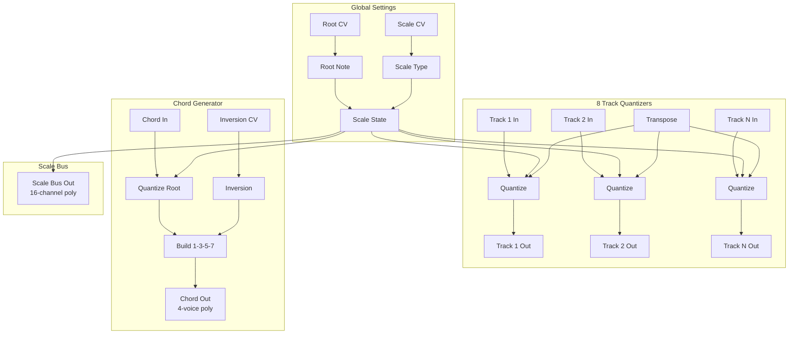

# The Architect

A poly-quantizer and chord machine with Scale Bus output for building coherent harmonic systems across multiple modules.

## Overview

The Architect is designed to be the harmonic "conductor" of your patch. It provides 8 independent quantizer tracks and a 4-voice chord generator, all sharing global Key/Scale settings. The **Scale Bus** output broadcasts the current scale as a 16-channel polyphonic signal, allowing other modules to quantize or generate notes that stay in key.

**Width:** 5HP

## Signal Flow



## The Scale Bus Protocol

The Scale Bus is a **16-channel polyphonic output** that broadcasts the current scale configuration. This allows any module in your patch to read the scale and generate or quantize notes that stay in key.

### Channel Layout

| Channels | Content | Voltage | Purpose |
|----------|---------|---------|---------|
| **0-11** | Scale Mask | 0V or 10V | Which chromatic notes are in the scale |
| **12-14** | Reserved | 0V | Future use |
| **15** | Root Note | 0V - 11/12V | The root note as V/Oct offset |

### Scale Mask (Channels 0-11)

Each channel represents one chromatic note:

| Channel | Note | Voltage when active |
|---------|------|---------------------|
| 0 | C | 10V |
| 1 | C# / Db | 10V |
| 2 | D | 10V |
| 3 | D# / Eb | 10V |
| 4 | E | 10V |
| 5 | F | 10V |
| 6 | F# / Gb | 10V |
| 7 | G | 10V |
| 8 | G# / Ab | 10V |
| 9 | A | 10V |
| 10 | A# / Bb | 10V |
| 11 | B | 10V |

- **10V** = Note is in the current scale (allowed)
- **0V** = Note is not in the scale (should be skipped or quantized)

The mask is output in **absolute chromatic positions**, not relative to root. For example, if you select **D Major** (D, E, F#, G, A, B, C#), the channels will be:

| Ch | Note | In D Major? | Voltage |
|----|------|-------------|---------|
| 0 | C | No | 0V |
| 1 | C# | Yes | 10V |
| 2 | D | Yes (root) | 10V |
| 3 | D# | No | 0V |
| 4 | E | Yes | 10V |
| 5 | F | No | 0V |
| 6 | F# | Yes | 10V |
| 7 | G | Yes | 10V |
| 8 | G# | No | 0V |
| 9 | A | Yes | 10V |
| 10 | A# | No | 0V |
| 11 | B | Yes | 10V |

### Root Note (Channel 15)

The root note is encoded as a V/Oct offset from C:

| Root | Voltage |
|------|---------|
| C | 0.000V |
| C# | 0.083V (1/12) |
| D | 0.167V (2/12) |
| D# | 0.250V (3/12) |
| E | 0.333V (4/12) |
| F | 0.417V (5/12) |
| F# | 0.500V (6/12) |
| G | 0.583V (7/12) |
| G# | 0.667V (8/12) |
| A | 0.750V (9/12) |
| A# | 0.833V (10/12) |
| B | 0.917V (11/12) |

This allows sequencers to know where "home" is - useful for generative algorithms that should gravitate toward the root note.

## Reading the Scale Bus (For Developers)

If you're developing a module that should read the Scale Bus:

```cpp
// Check if Scale Bus is connected
if (inputs[SCALE_BUS_INPUT].isConnected()) {

    // 1. Read the root note
    float rootVoltage = inputs[SCALE_BUS_INPUT].getVoltage(15);
    int root = static_cast<int>(std::round(rootVoltage * 12.f)) % 12;

    // 2. Read the scale mask
    bool scaleMask[12];
    for (int i = 0; i < 12; i++) {
        // Threshold at 1V to allow for some noise
        scaleMask[i] = inputs[SCALE_BUS_INPUT].getVoltage(i) > 1.0f;
    }

    // 3. Use the mask to quantize or generate notes
    // Example: find nearest note in scale
    int quantize(int note) {
        int chroma = note % 12;
        if (scaleMask[chroma]) return note;  // Already in scale

        // Search outward for nearest scale note
        for (int offset = 1; offset <= 6; offset++) {
            int below = (chroma - offset + 12) % 12;
            int above = (chroma + offset) % 12;
            if (scaleMask[below]) return note - offset;
            if (scaleMask[above]) return note + offset;
        }
        return note;  // Fallback (chromatic scale)
    }
}
```

### Quantization Algorithm

When quantizing to the scale:

1. Convert input voltage to chromatic note (0-11)
2. Check if that note is in the mask
3. If yes, output unchanged
4. If no, search for nearest note in the scale
5. Prefer lower notes when equidistant (musical convention)

### Generative Algorithms

For generative sequencers, the root note enables "complexity" or "tension" controls:

- **Low complexity:** Generate notes near the root (channel 15 voltage)
- **Medium complexity:** Generate notes anywhere in the scale
- **High complexity:** Allow chromatic passing tones

## Visual Debugging

Patch the Scale Bus into a **scope** or **spectrum analyzer** to visualize the scale:

- You'll see 12 "bars" representing the chromatic notes
- Active scale notes appear as tall bars (10V)
- Inactive notes appear as flat (0V)
- The pattern visually shows the scale shape

This makes it easy to verify your scale selection and debug harmony issues.

## Available Scales

| Index | Scale | Pattern | Notes in C |
|-------|-------|---------|------------|
| 0 | Major (Ionian) | W-W-H-W-W-W-H | C D E F G A B |
| 1 | Minor (Aeolian) | W-H-W-W-H-W-W | C D Eb F G Ab Bb |
| 2 | Dorian | W-H-W-W-W-H-W | C D Eb F G A Bb |
| 3 | Phrygian | H-W-W-W-H-W-W | C Db Eb F G Ab Bb |
| 4 | Lydian | W-W-W-H-W-W-H | C D E F# G A B |
| 5 | Mixolydian | W-W-H-W-W-H-W | C D E F G A Bb |
| 6 | Locrian | H-W-W-H-W-W-W | C Db Eb F Gb Ab Bb |
| 7 | Harmonic Minor | W-H-W-W-H-3H-H | C D Eb F G Ab B |
| 8 | Melodic Minor | W-H-W-W-W-W-H | C D Eb F G A B |
| 9 | Pentatonic Major | W-W-3H-W-3H | C D E G A |
| 10 | Pentatonic Minor | 3H-W-W-3H-W | C Eb F G Bb |
| 11 | Whole Tone | W-W-W-W-W-W | C D E F# G# A# |
| 12 | Chromatic | H-H-H-H-H-H-H-H-H-H-H-H | All 12 notes |

## Parameters

| Control | Range | Default | Description |
|---------|-------|---------|-------------|
| **Root** | C - B | C | Root note of the scale |
| **Scale** | 0 - 12 | Major | Scale type (see table above) |
| **Transpose** | -24 to +24 | 0 | Global transposition in semitones |
| **Inversion** | 0 - 3 | Root | Chord inversion (root, 1st, 2nd, 3rd) |

## Inputs

| Jack | Description |
|------|-------------|
| **Track 1-8** | V/Oct inputs for each quantizer track |
| **Chord** | V/Oct input for chord generator |
| **Root CV** | Modulates root note (~1.2V per semitone) |
| **Scale CV** | Modulates scale type (~1.3V per scale) |
| **Inversion CV** | Modulates chord inversion (~0.4V per step) |

## Outputs

| Jack | Channels | Description |
|------|----------|-------------|
| **Track 1-8** | Mono | Quantized V/Oct for each track |
| **Chord** | 4-poly | Root, 3rd, 5th, 7th of the chord |
| **Scale Bus** | 16-poly | Scale mask (0-11) + root (15) |

## Patch Ideas

### Harmonic Ecosystem

1. Patch Scale Bus to multiple generative sequencers
2. All sequencers stay in the same key automatically
3. Use Root CV to modulate key changes across the entire patch

### Chord Progression System

1. Use a slow sequencer to modulate Root CV
2. Chord output follows the progression
3. Melody sequencers read Scale Bus to stay in key

### Live Performance

1. Map Root and Scale to MIDI controller knobs
2. Instantly change the harmonic center of your entire patch
3. All connected modules follow the change

### Visualization Patch

1. Connect Scale Bus to a 12-channel meter or scope
2. See the scale pattern change as you adjust settings
3. Great for learning music theory

## Compatibility

The Scale Bus format is designed for interoperability:

- **Channels 0-11 (10V mask):** Compatible with modules that expect a scale mask
- **Threshold at 1V:** Allows for some cable noise/attenuation
- **Absolute positions:** No need to know the root to quantize
- **Root on channel 15:** Optional - modules can ignore it if not needed

## Technical Notes

### CV Modulation Scaling

| Parameter | CV Range | Effect |
|-----------|----------|--------|
| Root | ±5V | ~10V covers full chromatic range |
| Scale | ±5V | ~10V cycles through all 13 scales |
| Inversion | ±5V | ~1.6V covers all 4 inversions |

### Quantization Behavior

- Input voltages are rounded to nearest semitone before scale lookup
- Octave is preserved during quantization
- Transpose is applied after quantization

### Chord Voicing

The chord generator builds diatonic 7th chords:

1. **Root:** Quantized input note
2. **3rd:** 2 scale degrees up from root
3. **5th:** 4 scale degrees up from root
4. **7th:** 6 scale degrees up from root

Inversions raise notes by one octave:
- **Root position:** 1-3-5-7
- **1st inversion:** 3-5-7-1(+8va)
- **2nd inversion:** 5-7-1(+8va)-3(+8va)
- **3rd inversion:** 7-1(+8va)-3(+8va)-5(+8va)
